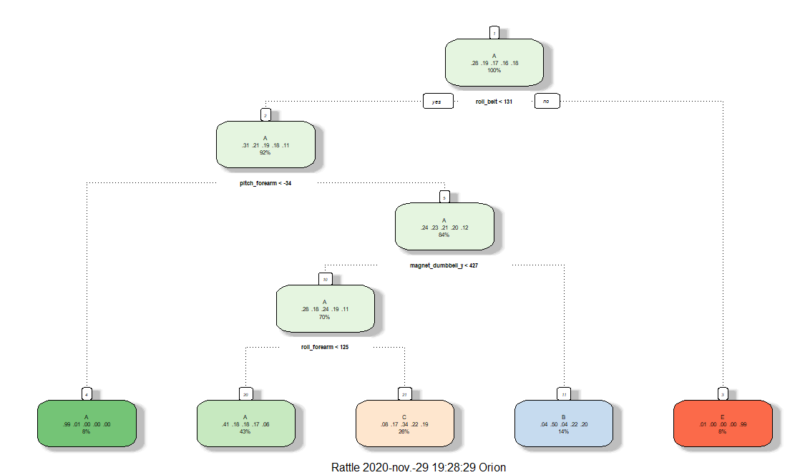
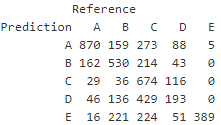
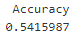
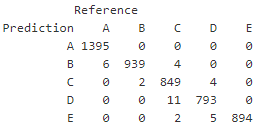
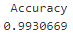
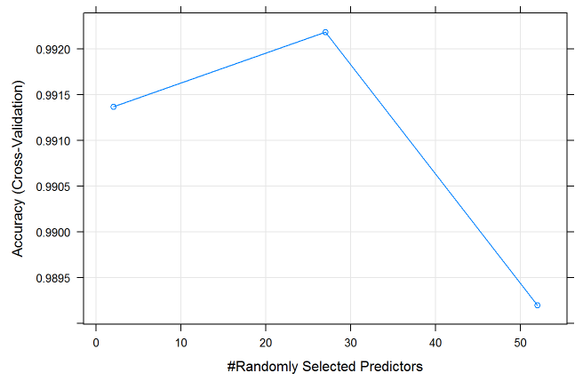
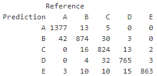
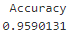

# Project report

<strong> Getting data </strong>

I started loading the required packages and downloading the data 

<em>
library(caret)  
library(rattle)  
TrainDownload<-read.csv(url("https://d396qusza40orc.cloudfront.net/predmachlearn/pml-training.csv"),header=TRUE)  
TestDownload<-read.csv(url("https://d396qusza40orc.cloudfront.net/predmachlearn/pml-testing.csv"),header=TRUE)  
</em>
 

The train dataset consists is a csv file with 19622 rows and 160 columns, while the test dataset has 20 rows and 160 columns. 

 

<strong> Cleaning data </strong>

Let's take a look at the data

<em> str(TrainDownload) </em>

We can observe, first, that the first seven observations correspond to data from the test subjects, which have no objective relevance in the prediction. In addition, many missing values and NA are observed in some of the variables, which will not be useful to make predictions either.  
For this reason, it is decided to eliminate the columns that contain missing values or NA

<em>
indexTr<-which(colSums(is.na(TrainDownload)|TrainDownload=="")>0.9*dim(TrainDownload)[1])  
indexTe<- which(colSums(is.na(TestDownload) |TestDownload=="")>0.9*dim(TestDownload)[1])  
TrainData <- TrainDownload[,-indexTr]  
TestData <- TestDownload[,-indexTe]  
TrainData <- TrainData[, -c(1:7)]  
TestData <- TestData[,-1]  
</em>

Now, we partition the data. Note that the seed is set to a random value  

<em>
set.seed(3535)  
indexDivTr<-createDataPartition(TrainData$classe,p=0.75,list = FALSE)  
TrainPartition<-TrainData[indexDivTr,]  
TestPartition<-TrainData[-indexDivTr,]  
</em>
 
It is time to start with the predictions. The methods of classification trees, random forests and the gradient boosting method are used. First, we apply cross validation with n=5, this will limit the effects of overfitting, and improve the efficicency of the models  

<em> controlTr <- trainControl(method = "cv",number = 5) </em>

 
<strong> Classification trees </strong>  

<em>
CT <- train(classe~.,data=TrainPartition,method="rpart",trControl=controlTr) 
fancyRpartPlot(CT$finalModel) 
</em>
 

 

<em>
predictionCT <- predict(CT, newdata=TestPartition)  
confMatCT <- confusionMatrix(TestPartition$classe,predictionCT)  
confMatCT$table  
</em>

 

<em>confMatCT$overall[1] </em> 

 

Very low accuracy was obtained with this method, so it is not recommended for prediction  

  
<strong> Random forests </strong>  

<em>
RF <- train(classe~., data=TrainPartition, method="rf", trControl=controlTr, verbose=FALSE)  
predictionRF <- predict(RF,newdata=TestPartition)  
confMatRF <- confusionMatrix(TestPartition$classe,predictionRF)  
confMatRF$table  
</em>
  

 

<em> confMatRF$overall[1] </em>

 

In contrast, this method gives a very high accuracy, very close to 1, which means that it will allow accurate predictions  

If we graphically analyze the precision of the model according to the number of predictors, the following is observed  

<em> plot(RF) </em>  

 

Although the maximum precision is accuracy with 27 predictors, from 2 it is obtained almost as high accuracy  

  
<strong> Gradient Boosting Method </strong>  

<em>
GBM <- train(classe~., data=TrainPartition, method="gbm", trControl=controlTr, verbose=FALSE)  
predictionGBM <- predict(GBM,newdata=TestPartition)  
confMatGBM <- confusionMatrix(TestPartition$classe,predictionGBM) 
confMatGBM$table  
</em>
  
 
 

<em> confMatGBM$overall[1] </em>

 

Although with this method a high accuracy is also obtained, it can be concluded that the optimal method for prediction is random forests, using 27 predictors, which will give a margin of error of less than 1%
